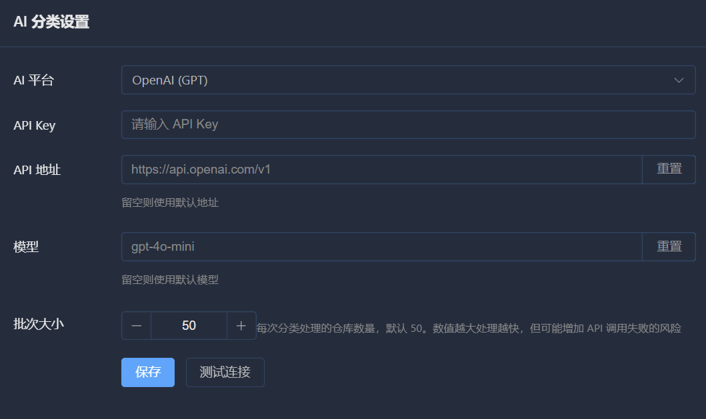
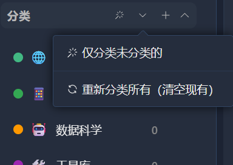
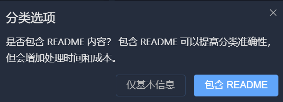

# AI 智能分类

StarHub 支持使用 AI 自动为你的 GitHub Stars 分类，大大节省手动整理的时间。

## 功能概述

AI 智能分类会分析每个仓库的：

- 仓库名称
- 仓库描述
- 编程语言
- Topics 标签
- README 内容（可选）

然后自动将仓库归类到合适的标签中。

## 支持的 AI 服务

| 服务商 | 默认模型 | 优势 | 价格 |
|--------|----------|------|------|
| OpenAI | gpt-4o-mini | 准确率高 | ~$0.005/100 个仓库 |
| Claude | claude-3-5-sonnet | 理解深入 | ~$0.08/100 个仓库 |
| DeepSeek | deepseek-chat | 性价比高 | ~¥0.03/100 个仓库 |
| 通义千问 | qwen-plus | 中文友好 | ~¥0.05/100 个仓库 |
| 智谱 AI | glm-4-flash | 有免费额度 | 免费 |

## 配置 AI 服务

  

### 步骤 1：获取 API Key

选择一个 AI 服务，获取 API Key：

- **OpenAI**: https://platform.openai.com/api-keys
- **Claude**: https://console.anthropic.com/settings/keys
- **DeepSeek**: https://platform.deepseek.com/api_keys
- **通义千问**: https://dashscope.aliyun.com/
- **智谱 AI**: https://open.bigmodel.cn/

### 步骤 2：配置 StarHub

1. 点击右上角用户头像 → **设置**
2. 在 **AI 分类设置** 区域：
   - 选择 AI 服务商
   - 输入 API Key
   - （可选）自定义 API 地址和模型
3. 点击 **保存**

## 使用 AI 分类

  

### 触发分类

1. 返回主页
2. 在左侧标签区域，点击 **AI 分类** 按钮（✨）
3. 选择分类模式

### 分类模式

| 模式 | 说明 | 适用场景 |
|------|------|----------|
| 仅未分类 | 只处理没有标签的仓库 | 增量分类 |
| 重新分类所有 | 清空所有标签，全部重新分类 | 重新整理 |

### 分类过程

1. StarHub 会按批次处理仓库（默认 50 个/批）
2. 进度条显示当前进度
3. 分类完成后自动刷新列表

## 高级配置

### 批次大小

控制每次 AI 请求处理的仓库数量：

| 设置 | 说明 |
|------|------|
| 10 | 小批量，适合测试 |
| 30 | 中等批量 |
| 50 | **默认**，平衡效率和准确性 |
| 100 | 大批量，速度快但可能影响准确性 |

:::tip
如果分类不准确，尝试减小批次大小。
:::

### 读取 README

  

开启后，AI 会读取仓库的 README 进行分类：

| 选项 | 优点 | 缺点 |
|------|------|------|
| 开启 | 分类更准确 | Token 消耗多，速度慢 |
| 关闭 | 速度快，成本低 | 可能不够准确 |

## 分类效果优化

### 提高准确率

1. **开启读取 README**：让 AI 了解更多仓库信息
2. **减小批次大小**：每批处理更少的仓库
3. **使用更强模型**：如 gpt-4o 或 claude-3-5-sonnet

### 降低成本

1. **关闭读取 README**：显著减少 Token 消耗
2. **使用经济模型**：gpt-4o-mini 或 deepseek-chat
3. **只分类未分类仓库**：避免重复分类

## 手动调整

AI 分类不可能 100% 准确，建议：

1. 先使用 AI 完成大部分分类
2. 浏览各分类，检查分类结果
3. 手动调整不准确的仓库

### 移动仓库到其他分类

1. 点击仓库查看详情
2. 移除当前标签
3. 添加正确的标签

## 成本估算

以 1000 个仓库为例（不读取 README）：

| 服务 | 预估费用 |
|------|----------|
| OpenAI gpt-4o-mini | ~$0.05 |
| DeepSeek | ~¥0.3 |
| 通义千问 qwen-plus | ~¥0.5 |
| 智谱 glm-4-flash | 免费 |

:::tip
**推荐**：
- 个人用户：智谱 AI（免费额度）或 DeepSeek（性价比高）
- 大量数据：OpenAI gpt-4o-mini（稳定可靠）
:::

## 常见问题

### 分类失败？

1. 检查 API Key 是否正确
2. 确认账户余额充足
3. 检查网络连接
4. 尝试减小批次大小

### 分类不准确？

1. 开启"读取 README"选项
2. 尝试更强大的模型
3. 减小批次大小

### 速度太慢？

1. 增加批次大小
2. 关闭"读取 README"
3. 使用更快的模型（如 gpt-4o-mini）

## 下一步

- [搜索与筛选](search.md) - 使用分类结果
- [AI 服务配置详解](../config/ai.md) - 详细配置说明

