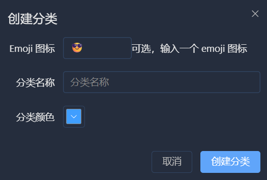
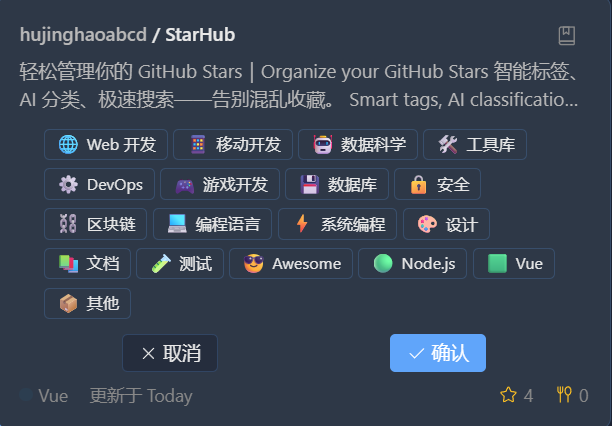
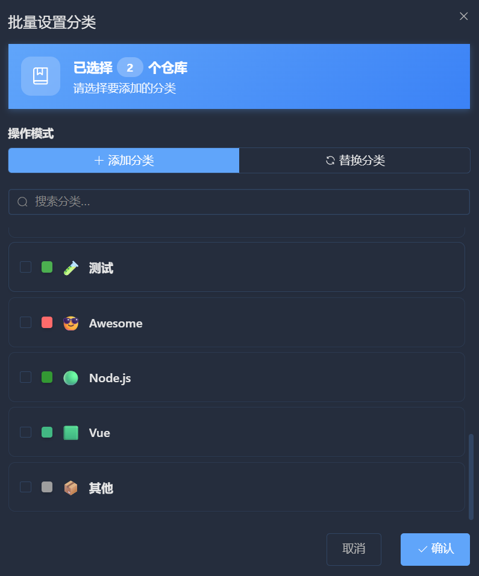
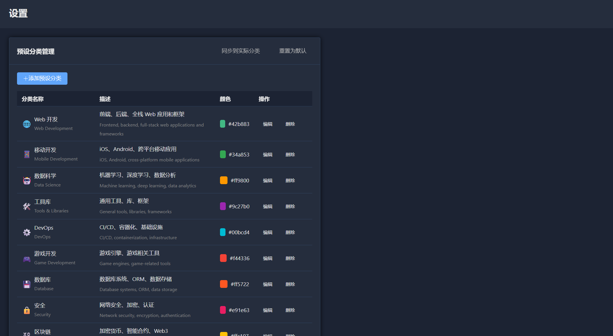

# 标签管理

标签是 StarHub 的核心功能，让你可以自由组织 GitHub Stars。

## 理解标签系统

### 什么是标签？

标签是你为仓库添加的分类标识。一个仓库可以有多个标签，一个标签可以关联多个仓库。

### 标签属性

每个标签包含：

| 属性 | 说明 | 示例 |
|------|------|------|
| 名称 | 标签的显示名称 | Web 开发 |
| Emoji | 标签的图标 | 🌐 |
| 颜色 | 标签的背景颜色 | #42b883 |

## 创建标签

<p align="center">
  
</p>

1. 点击左侧标签区域的 **+** 按钮
2. 输入标签名称
3. 选择 Emoji 和颜色
4. 点击 **创建**


## 删除标签

1. 在左侧标签列表中，悬停在标签上
2. 点击 **删除** 图标 (🗑️)
3. 确认删除

:::warning
删除标签后，所有仓库与该标签的关联都会被移除。此操作不可恢复！
:::

## 为仓库添加标签

### 单个仓库

<p align="center">
  
</p>

1. 点击仓库，打开详情面板
2. 在标签区域点击 **+**
3. 选择已有标签或创建新标签

### 批量添加

<p align="center">
  
</p>

1. 点击仓库列表顶部的 **选择** 按钮
2. 勾选要操作的仓库
3. 点击 **批量设置分类**
4. 选择要添加的标签
5. 点击 **确定**

## 移除标签

### 从单个仓库移除

1. 点击仓库，打开详情面板
2. 点击标签上的 **×** 按钮

### 批量移除

1. 进入选择模式
2. 选中仓库
3. 点击 **批量设置分类**
4. 取消勾选要移除的标签

## 使用标签筛选

点击左侧的任意标签，仓库列表只显示包含该标签的仓库。

### 组合筛选

1. 点击一个标签进行筛选
2. 同时使用搜索框缩小范围

## 预设标签

<p align="center">
  
</p>

StarHub 内置 18 种预设标签模板：

| 标签 | Emoji | 颜色 | 适用场景 |
|------|-------|------|----------|
| Web 开发 | 🌐 | #42b883 | 前后端框架 |
| 移动开发 | 📱 | #34a853 | iOS/Android |
| 数据科学 | 🤖 | #ff9800 | ML/AI |
| 工具库 | 🛠️ | #9c27b0 | 通用工具 |
| DevOps | ⚙️ | #00bcd4 | CI/CD |
| 游戏开发 | 🎮 | #f44336 | 游戏引擎 |
| 数据库 | 💾 | #ff5722 | 数据存储 |
| 安全 | 🔒 | #e91e63 | 网络安全 |
| 区块链 | ⛓️ | #ffc107 | Web3 |
| 编程语言 | 💻 | #3f51b5 | 语言工具 |
| 系统编程 | ⚡ | #607d8b | 底层开发 |
| 设计 | 🎨 | #e91e63 | UI/UX |
| 文档 | 📚 | #795548 | 文档工具 |
| 测试 | 🧪 | #4caf50 | 测试框架 |
| Awesome | 😎 | #ff6b6b | 资源列表 |
| Node.js | 🟢 | #339933 | Node 生态 |
| Vue | 🟩 | #41b883 | Vue 项目与插件 |
| 其他 | 📦 | #9e9e9e | 未分类 |

## 标签最佳实践

### 1. 保持简洁

- 避免创建过多标签
- 使用通用的分类名称
- 定期清理不用的标签

### 2. 使用层级

虽然 StarHub 不支持嵌套标签，但可以通过命名约定实现：

```
前端 / React
前端 / Vue
后端 / Node
后端 / Go
```

### 3. 结合 AI 分类

1. 首先使用 AI 自动分类
2. 然后手动调整不准确的分类
3. 为特殊项目添加自定义标签

## 下一步

- [AI 智能分类](ai-classification.md) - 让 AI 帮你分类
- [搜索与筛选](search.md) - 配合搜索使用标签

